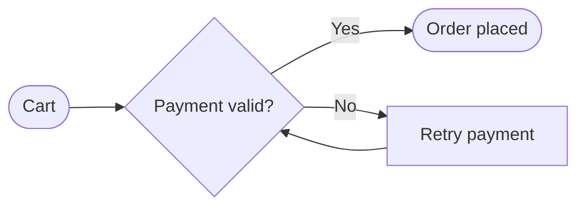

# DeepSeek Harness Flowchart

An installable DeepSeek Harness profile bundle that adds a `render_flowchart` tool. The tool turns Mermaid flowchart source into a polished, themed, self-contained SVG and delegates file creation to Harness's existing `write` tool.

[中文说明](README.zh.md)

## Install

Requires DeepSeek Harness `0.1.0-rc.6` or later and GitHub CLI access to this private repository.

```sh
gh repo clone lizhecome/deepseek-harness-flowchart
cd deepseek-harness-flowchart
dsh plugin --profile web add --ignore-workspace-root-check .
```

Use `headless` instead of `web` for one-shot tasks. DeepSeek Harness anchors `add .` to the invoking checkout before pnpm switches to the profile directory. The package manifest declares a `dsh.bundle` patch, so installation mounts the tool and its invariant companion automatically.

To remove it:

```sh
dsh plugin --profile web remove --ignore-workspace-root-check @lizhecome/dsh-flowchart
```

## Use

Ask the agent for a flowchart and name the SVG destination, for example:

```text
Create a left-to-right flowchart of the checkout process and save it as docs/checkout.svg. Use the catppuccin-mocha theme.
```

The model calls `render_flowchart` with Mermaid source similar to:



The tool accepts only Mermaid `flowchart`/`graph` documents with an explicit `TD`, `TB`, `BT`, `LR`, or `RL` direction. The destination must end in `.svg`.

## Tool arguments

| Argument | Required | Meaning |
|---|---:|---|
| `source` | yes | Complete Mermaid flowchart source. |
| `file_path` | yes | SVG destination resolved by the installed `write` tool. |
| `theme` | no | One of the 15 themes below; defaults to the deployment setting. |
| `transparent` | no | Remove the theme background; default `false`. |
| `padding` | no | Canvas padding, `0`–`200`; default `40`. |
| `node_spacing` | no | Horizontal sibling spacing, `8`–`160`; default `24`. |
| `layer_spacing` | no | Vertical layer spacing, `8`–`240`; default `40`. |

Themes: `zinc-light`, `zinc-dark`, `tokyo-night`, `tokyo-night-storm`, `tokyo-night-light`, `catppuccin-mocha`, `catppuccin-latte`, `nord`, `nord-light`, `dracula`, `github-light`, `github-dark`, `solarized-light`, `solarized-dark`, and `one-dark`.

## Configuration

Later profile patches replace a row's complete `config`, so restate every field you want to keep:

```yaml
- id: flowchart
  config:
    defaultTheme: github-light
    maxSourceChars: 50000
    maxSvgBytes: 2000000
```

| Field | Default | Meaning |
|---|---:|---|
| `defaultTheme` | `tokyo-night` | Theme used when a tool call omits `theme`. |
| `maxSourceChars` | `50000` | Positive integer limit on complete Mermaid input. |
| `maxSvgBytes` | `2000000` | Positive integer limit on the complete UTF-8 SVG. |

Invalid bounds or an unavailable configured theme fail at plugin load.

## Filesystem and SVG safety

The plugin never writes through Node's ambient filesystem. It dispatches the generated content to the registered Harness `write` tool as a nested call, so tool restrictions, approval, sandbox policy, read-before-overwrite rules, cancellation, and final result normalization remain authoritative. If `write` is unavailable or denied, `render_flowchart` fails without claiming success.

Before dispatching the SVG, the plugin removes renderer-owned external font imports, rejects scripts, event handlers, embedded browser documents, JavaScript URLs, and external `href` values, and applies `maxSvgBytes` to the complete self-contained result.

## Model and token effects

The model sees one tool schema. A successful call returns only the output path, theme, and byte count; the SVG body is passed to the nested `write` tool but is not copied into the parent model result. Changing package configuration or tool availability changes the request's tool-schema prefix.

Rendering is local and deterministic; it makes no LLM or network request. The implementation uses [beautiful-mermaid](https://github.com/lukilabs/beautiful-mermaid) `1.1.3` for Mermaid parsing, layout, theming, and SVG generation.

## Known limitations

- Only flowcharts are accepted; sequence, class, state, ER, XY, and other Mermaid diagrams are rejected.
- Output is SVG only. PNG/PDF conversion is not included.
- Existing-file replacement follows the installed `write` tool policy and may require the agent to read the file first.
- The removed web-font import means viewers use their local `Inter` or system sans-serif font.

## Development

```sh
pnpm install
pnpm run check
```

Tests boot the published Harness tool runtime, filesystem provider, and real `write` tool. They verify themed SVG creation, concise result/file agreement, limits, unsupported input, missing-write failure, presentation metadata, and registration disposal.
