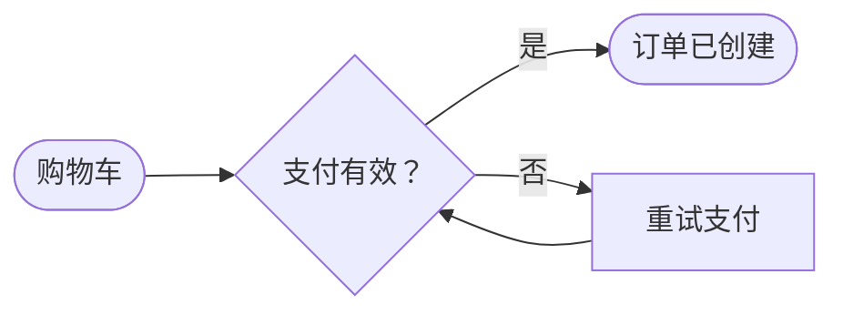

# DeepSeek Harness 优美流程图插件

这是一个可安装的 DeepSeek Harness profile bundle，会新增 `render_flowchart` 工具。它把 Mermaid 流程图源码渲染成带主题、自包含的优美 SVG，并把文件创建委托给 Harness 已有的 `write` 工具。

[English](README.md)

## 安装

要求 DeepSeek Harness `0.1.0-rc.6` 或更高版本，并且 GitHub CLI 有权访问这个私有仓库。

```sh
gh repo clone lizhecome/deepseek-harness-flowchart
cd deepseek-harness-flowchart
dsh plugin --profile web add --ignore-workspace-root-check .
```

若要用于一次性任务，可将 `web` 改为 `headless`。DeepSeek Harness 会先把 `add .` 锚定到当前 checkout，再让 pnpm 切换到 profile 目录。包清单声明了 `dsh.bundle` patch，因此安装后会自动挂载工具及其 invariant companion。

卸载命令：

```sh
dsh plugin --profile web remove --ignore-workspace-root-check @lizhecome/dsh-flowchart
```

## 使用

直接让 agent 生成流程图并指定 SVG 路径，例如：

```text
创建一张从左到右的结账流程图，保存到 docs/checkout.svg，并使用 catppuccin-mocha 主题。
```

模型会调用 `render_flowchart`，并提交类似下面的 Mermaid 源码：



工具只接受带有明确 `TD`、`TB`、`BT`、`LR` 或 `RL` 方向的 Mermaid `flowchart`／`graph` 文档，目标路径必须以 `.svg` 结尾。

## 工具参数

| 参数 | 必填 | 含义 |
|---|---:|---|
| `source` | 是 | 完整 Mermaid 流程图源码。 |
| `file_path` | 是 | 由已安装 `write` 工具解析的 SVG 目标路径。 |
| `theme` | 否 | 下列 15 套主题之一；默认使用部署配置。 |
| `transparent` | 否 | 移除主题背景；默认 `false`。 |
| `padding` | 否 | 画布留白，`0`–`200`；默认 `40`。 |
| `node_spacing` | 否 | 同层节点水平间距，`8`–`160`；默认 `24`。 |
| `layer_spacing` | 否 | 层间垂直间距，`8`–`240`；默认 `40`。 |

主题包括：`zinc-light`、`zinc-dark`、`tokyo-night`、`tokyo-night-storm`、`tokyo-night-light`、`catppuccin-mocha`、`catppuccin-latte`、`nord`、`nord-light`、`dracula`、`github-light`、`github-dark`、`solarized-light`、`solarized-dark` 和 `one-dark`。

## 配置

后应用的 profile patch 会整体替换一行的 `config`，因此需要重写所有希望保留的字段：

```yaml
- id: flowchart
  config:
    defaultTheme: github-light
    maxSourceChars: 50000
    maxSvgBytes: 2000000
```

| 字段 | 默认值 | 含义 |
|---|---:|---|
| `defaultTheme` | `tokyo-night` | 工具调用没有提供 `theme` 时使用的主题。 |
| `maxSourceChars` | `50000` | 完整 Mermaid 输入的正整数长度限制。 |
| `maxSvgBytes` | `2000000` | 完整 UTF-8 SVG 的正整数字节限制。 |

无效限制或不存在的配置主题会导致插件加载失败。

## 文件系统与 SVG 安全

插件不会通过 Node 的环境文件系统直接写文件。它会把生成内容作为嵌套调用交给已注册的 Harness `write` 工具，因此 tool restriction、approval、sandbox policy、read-before-overwrite、取消和最终结果规范化仍然具有最终权威。若 `write` 不存在或被拒绝，`render_flowchart` 会失败，不会宣称文件已生成。

在交付 SVG 前，插件会移除渲染器加入的外部字体 import，拒绝 script、事件处理器、嵌入式浏览器文档、JavaScript URL 和外部 `href`，并对完整自包含结果执行 `maxSvgBytes` 限制。

## 模型与 token 影响

模型会看到一个工具 schema。调用成功时只返回输出路径、主题和字节数；SVG 正文会交给嵌套 `write` 工具，但不会复制进父工具的模型结果。修改包配置或工具可用性会改变请求的工具 schema 前缀。

渲染完全在本地确定性完成，不调用 LLM，也不发起网络请求。实现使用 [beautiful-mermaid](https://github.com/lukilabs/beautiful-mermaid) `1.1.3` 完成 Mermaid 解析、布局、主题和 SVG 生成。

## 已知限制

- 只接受流程图；sequence、class、state、ER、XY 等其他 Mermaid 图类型会被拒绝。
- 只输出 SVG，不包含 PNG／PDF 转换。
- 覆盖已有文件时遵循已安装 `write` 工具的策略，可能要求 agent 先读取文件。
- 由于移除了网络字体 import，查看器会使用本地 `Inter` 或系统 sans-serif 字体。

## 开发

```sh
pnpm install
pnpm run check
```

测试会启动已发布的 Harness tool runtime、filesystem provider 和真实 `write` 工具，覆盖主题 SVG 创建、精简结果与文件一致性、限制、无效输入、缺失 write、展示元数据和注册 dispose。
